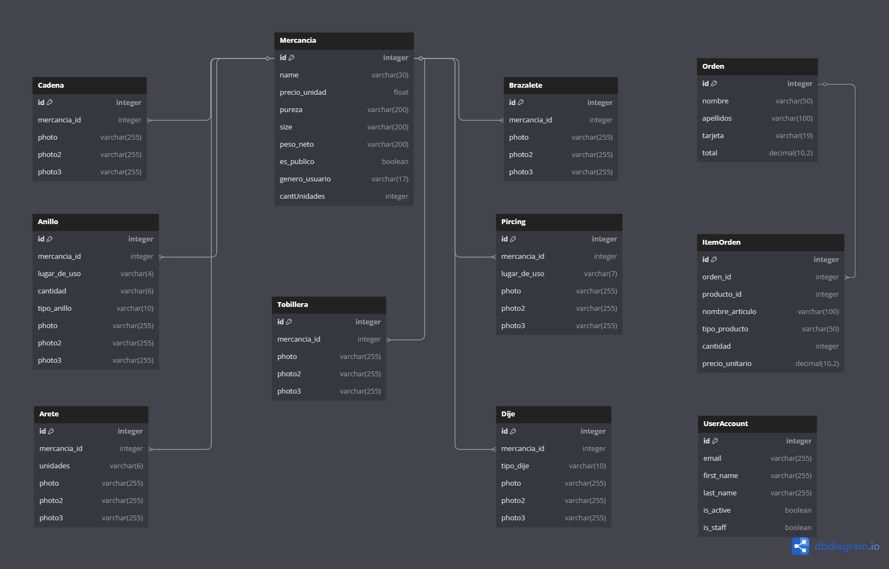

# 💎 Diseño de Base de Datos - E-commerce de Joyería
## Documentación Técnica para Sistema de Comercio Electrónico Especializado en Joyería

---

## 📋 Índice Técnico
- [Análisis y Metodología de Diseño](#análisis-y-metodología-de-diseño)
- [Arquitectura de Datos](#arquitectura-de-datos)
- [Modelo Conceptual y Lógico](#modelo-conceptual-y-lógico)
- [Diagrama Entidad-Relación](#diagrama-entidad-relación)
- [Normalización y Análisis de Formas Normales](#normalización-y-análisis-de-formas-normales)
- [Diseño Físico y Optimización](#diseño-físico-y-optimización)
- [Estructura de Tablas y Dominios](#estructura-de-tablas-y-dominios)
- [Integridad Referencial y Restricciones](#integridad-referencial-y-restricciones)
- [Estrategias de Indexación](#estrategias-de-indexación)
- [Performance Tuning y Optimización](#performance-tuning-y-optimización)
- [Procedimientos Almacenados y Funciones](#procedimientos-almacenados-y-funciones)
- [Estrategias de Escalabilidad](#estrategias-de-escalabilidad)
- [Implementación y Configuración](#implementación-y-configuración)
- [Testing y Validación](#testing-y-validación)
- [Mantenimiento y Monitoreo](#mantenimiento-y-monitoreo)

---

## 🎯 Análisis y Metodología de Diseño

### Enfoque Metodológico Aplicado

Este proyecto demuestra la aplicación de **metodologías profesionales de diseño de bases de datos** específicamente adaptadas para **e-commerce de joyería**, siguiendo un enfoque estructurado que abarca desde el análisis de requisitos comerciales hasta la implementación física optimizada para transacciones y gestión de inventario.

#### **Metodología Utilizada: Modelo Relacional para E-commerce**
- **Fase 1**: Análisis de Requisitos Comerciales y Modelado Conceptual
- **Fase 2**: Diseño Lógico con Normalización para E-commerce
- **Fase 3**: Diseño Físico con Optimización para Transacciones
- **Fase 4**: Implementación con Estrategias de Escalabilidad Comercial

### Análisis de Requisitos de Datos para E-commerce de Joyería

#### **Entidades Principales Identificadas**
```
USUARIOS (Users) - Clientes y administradores del sistema
CATEGORÍAS (Categories) - Clasificación de productos de joyería
PRODUCTOS (Products) - Catálogo de joyería (anillos, aretes, cadenas, etc.)
INVENTARIO (Inventory) - Control de stock y disponibilidad
CARRITOS (Carts) - Carritos de compra temporales
ÓRDENES (Orders) - Pedidos realizados por clientes
DETALLES_ORDEN (OrderItems) - Items específicos de cada orden
PAGOS (Payments) - Transacciones y métodos de pago
DIRECCIONES (Addresses) - Direcciones de envío y facturación
REVIEWS (Reviews) - Reseñas y calificaciones de productos
CUPONES (Coupons) - Descuentos y promociones
WISHLIST (Wishlist) - Lista de deseos de clientes
```

#### **Reglas de Negocio Críticas para Joyería**
1. **RN001**: Cada producto debe tener al menos una imagen de alta calidad
2. **RN002**: El inventario debe actualizarse en tiempo real con cada transacción
3. **RN003**: Los precios pueden variar según el material (oro, plata, platino)
4. **RN004**: Las órdenes deben mantener trazabilidad completa para productos de valor
5. **RN005**: Los pagos deben cumplir con estándares PCI DSS
6. **RN006**: Los productos deben categorizarse por tipo de joyería y material
7. **RN007**: El sistema debe soportar múltiples imágenes por producto
8. **RN008**: Las reseñas solo pueden ser creadas por clientes que compraron el producto

### Decisiones de Diseño Fundamentadas para E-commerce

#### **Selección del Motor de Base de Datos**
- **Motor Elegido**: PostgreSQL 14+ / MySQL 8.0+ InnoDB
- **Justificación Técnica para E-commerce**:
  - ACID compliance completo para transacciones financieras
  - Soporte robusto para transacciones concurrentes
  - Optimizador de consultas avanzado para catálogos grandes
  - Escalabilidad horizontal mediante particionamiento
  - Soporte nativo para JSON (metadatos de productos)
  - Ecosistema maduro de herramientas de e-commerce

#### **Estrategia de Codificación**
- **Charset**: `utf8mb4` con `utf8mb4_unicode_ci`
- **Justificación**: Soporte completo para caracteres Unicode, incluyendo emojis en reseñas y caracteres especiales internacionales para nombres de productos

---

## 🏛️ Arquitectura de Datos para E-commerce

### Arquitectura Lógica del Sistema de Joyería

```
┌─────────────────────────────────────────────────────────────┐
│                    CAPA DE APLICACIÓN WEB                  │
├─────────────────────────────────────────────────────────────┤
│                    CAPA DE LÓGICA DE E-COMMERCE            │
│  ┌─────────────┐  ┌─────────────┐  ┌─────────────┐        │
│  │   USUARIOS  │  │  PRODUCTOS  │  │ CATEGORÍAS  │        │
│  └─────────────┘  └─────────────┘  └─────────────┘        │
│           │              │              │                  │
│           └──────────────┼──────────────┘                  │
│                          │                                 │
│  ┌─────────────┐  ┌─────────────┐  ┌─────────────┐        │
│  │   CARRITOS  │  │   ÓRDENES   │  │   PAGOS     │        │
│  └─────────────┘  └─────────────┘  └─────────────┘        │
│           │              │              │                  │
│  ┌─────────────┐  ┌─────────────┐  ┌─────────────┐        │
│  │ INVENTARIO  │  │   REVIEWS   │  │  WISHLIST   │        │
│  └─────────────┘  └─────────────┘  └─────────────┘        │
├─────────────────────────────────────────────────────────────┤
│                    CAPA FÍSICA (PostgreSQL/MySQL)         │
└─────────────────────────────────────────────────────────────┘
```

### Patrones de Diseño Implementados para E-commerce

#### **1. Patrón de Agregación Comercial**
- **Aplicación**: Orders → OrderItems → Products
- **Beneficio**: Integridad transaccional en compras y control de inventario

#### **2. Patrón de Catálogo de Productos**
- **Aplicación**: Categories → Products → ProductImages
- **Beneficio**: Organización jerárquica y gestión multimedia

#### **3. Patrón de Carrito de Compras**
- **Aplicación**: Users → Carts → CartItems → Products
- **Beneficio**: Persistencia de sesión y recuperación de carritos abandonados

#### **4. Patrón de Auditoría Financiera**
- **Aplicación**: Orders → Payments → PaymentLogs
- **Beneficio**: Trazabilidad completa de transacciones para cumplimiento

---

## 📊 Modelo Conceptual y Lógico para Joyería

### Modelo Conceptual (Nivel Alto)

#### **Entidades Principales y Atributos Clave**

**USUARIO (Customer/Admin)**
- Identificación: ID único, email, username
- Perfil: nombre completo, teléfono, fecha de nacimiento
- Seguridad: password hasheado, rol (customer/admin)
- Comercial: fecha de registro, último login, estado activo

**CATEGORÍA DE JOYERÍA**
- Identificación: ID único, nombre, slug
- Jerarquía: categoría padre (anillos, aretes, cadenas, etc.)
- Metadata: descripción, imagen, orden de visualización
- SEO: meta_title, meta_description

**PRODUCTO DE JOYERÍA**
- Identificación: ID único, SKU, nombre
- Comercial: precio, precio_oferta, disponible
- Descriptivo: descripción, material, peso, dimensiones
- Categorización: categoría, subcategoría, tags
- Multimedia: imágenes múltiples, imagen principal
- SEO: slug, meta_description

**INVENTARIO**
- Control: producto_id, cantidad_disponible, cantidad_reservada
- Alertas: stock_mínimo, estado (disponible/agotado)
- Auditoría: última actualización, movimientos

**ORDEN DE COMPRA**
- Identificación: ID único, número de orden
- Cliente: usuario_id, información de contacto
- Comercial: subtotal, impuestos, descuentos, total
- Logística: dirección de envío, método de envío, costo de envío
- Estados: pendiente, procesando, enviado, entregado, cancelado
- Temporal: fecha de orden, fecha estimada de entrega

**PAGO**
- Transacción: orden_id, método de pago, monto
- Procesamiento: gateway de pago, transaction_id externo
- Estado: pendiente, completado, fallido, reembolsado
- Seguridad: token de transacción, datos encriptados

### Modelo Lógico (Nivel Detallado)

#### **Dominios de Datos Específicos para Joyería**

```sql
-- Dominio para tipos de joyería
DOMAIN jewelry_type AS ENUM('anillo', 'arete', 'cadena', 'pulsera', 'dije', 'piercing', 'tobillera', 'brazalete')

-- Dominio para materiales
DOMAIN jewelry_material AS ENUM('oro_18k', 'oro_14k', 'plata_925', 'platino', 'acero_inoxidable', 'titanio', 'cobre')

-- Dominio para estados de orden
DOMAIN order_status AS ENUM('pendiente', 'confirmado', 'procesando', 'enviado', 'entregado', 'cancelado', 'reembolsado')

-- Dominio para métodos de pago
DOMAIN payment_method AS ENUM('tarjeta_credito', 'tarjeta_debito', 'paypal', 'transferencia', 'efectivo_contraentrega')

-- Dominio para estados de pago
DOMAIN payment_status AS ENUM('pendiente', 'procesando', 'completado', 'fallido', 'reembolsado', 'cancelado')

-- Dominio para roles de usuario
DOMAIN user_role AS ENUM('customer', 'admin', 'manager')

-- Dominio para estados de producto
DOMAIN product_status AS ENUM('activo', 'inactivo', 'descontinuado', 'agotado')
```

---

## 🔗 Diagrama Entidad-Relación



### Análisis del Diagrama ER para E-commerce

#### **Cardinalidades Implementadas**
- **Users : Orders** = 1:N (un cliente puede tener múltiples órdenes)
- **Users : Carts** = 1:1 (un cliente tiene un carrito activo)
- **Users : Addresses** = 1:N (múltiples direcciones por cliente)
- **Categories : Products** = 1:N (una categoría contiene múltiples productos)
- **Products : OrderItems** = 1:N (un producto puede estar en múltiples órdenes)
- **Products : CartItems** = 1:N (un producto puede estar en múltiples carritos)
- **Products : Reviews** = 1:N (un producto puede tener múltiples reseñas)
- **Products : ProductImages** = 1:N (múltiples imágenes por producto)
- **Orders : OrderItems** = 1:N (una orden contiene múltiples items)
- **Orders : Payments** = 1:N (una orden puede tener múltiples intentos de pago)

#### **Restricciones de Participación Comercial**
- **Obligatoria**: Todo producto debe tener al menos una categoría
- **Obligatoria**: Toda orden debe tener al menos un item
- **Opcional**: Los productos pueden no tener reseñas
- **Condicional**: Los carritos pueden estar vacíos temporalmente

---

## 📐 Normalización y Análisis de Formas Normales

### Proceso de Normalización Aplicado para E-commerce

#### **Primera Forma Normal (1NF) ✅**
- **Cumplimiento**: Todos los atributos contienen valores atómicos
- **Evidencia**: No existen arrays de imágenes; se usa tabla separada `product_images`
- **Ejemplo**: El campo `material` en `products` es atómico (ENUM)

#### **Segunda Forma Normal (2NF) ✅**
- **Cumplimiento**: Eliminación de dependencias parciales
- **Evidencia**: Todas las tablas tienen claves primarias simples (ID)
- **Justificación**: Los atributos de `order_items` dependen completamente de la clave primaria

#### **Tercera Forma Normal (3NF) ✅**
- **Cumplimiento**: Eliminación de dependencias transitivas
- **Evidencia**: Los atributos no clave dependen únicamente de la clave primaria
- **Ejemplo**: En `products`, `category_id` no determina `price`

#### **Forma Normal de Boyce-Codd (BCNF) ✅**
- **Cumplimiento**: Cada determinante es una superclave
- **Análisis**: Las claves foráneas mantienen integridad sin crear dependencias problemáticas

### Decisiones de Desnormalización Controlada para Performance

#### **Caso 1: Información de Precio en OrderItems**
- **Decisión**: Duplicar `price` del producto en `order_items`
- **Justificación**: Preservar precio histórico vs. cambios futuros en catálogo
- **Trade-off**: Consistencia temporal vs. integridad referencial

#### **Caso 2: Contadores de Stock**
- **Decisión**: Mantener `quantity_available` en tabla `products`
- **Justificación**: Performance en consultas de disponibilidad vs. normalización estricta
- **Trade-off**: Velocidad de consulta vs. complejidad de actualización

---

## ⚡ Diseño Físico y Optimización para E-commerce

### Estrategias de Almacenamiento para Transacciones

#### **Configuración de Motor PostgreSQL para E-commerce**
```sql
-- Configuración optimizada para transacciones de e-commerce
ALTER SYSTEM SET shared_buffers = '256MB';
ALTER SYSTEM SET effective_cache_size = '1GB';
ALTER SYSTEM SET maintenance_work_mem = '64MB';
ALTER SYSTEM SET checkpoint_completion_target = 0.9;
ALTER SYSTEM SET wal_buffers = '16MB';
ALTER SYSTEM SET default_statistics_target = 100;
SELECT pg_reload_conf();
```

#### **Particionamiento Estratégico para Órdenes**
```sql
-- Particionamiento por fecha en tabla de órdenes
CREATE TABLE orders (
    id SERIAL PRIMARY KEY,
    user_id INTEGER NOT NULL,
    order_date DATE NOT NULL,
    total_amount DECIMAL(10,2) NOT NULL,
    status order_status NOT NULL
) PARTITION BY RANGE (order_date);

-- Particiones por año
CREATE TABLE orders_2023 PARTITION OF orders
    FOR VALUES FROM ('2023-01-01') TO ('2024-01-01');
CREATE TABLE orders_2024 PARTITION OF orders
    FOR VALUES FROM ('2024-01-01') TO ('2025-01-01');
CREATE TABLE orders_2025 PARTITION OF orders
    FOR VALUES FROM ('2025-01-01') TO ('2026-01-01');
```

### Optimización de Tipos de Datos para Joyería

#### **Selección Justificada de Tipos**
- **DECIMAL(10,2)**: Para precios (precisión monetaria)
- **VARCHAR(100)**: Para nombres de productos
- **TEXT**: Para descripciones detalladas
- **ENUM**: Para estados y categorías (eficiencia de almacenamiento)
- **TIMESTAMP WITH TIME ZONE**: Para auditoría global
- **JSON/JSONB**: Para metadatos de productos (PostgreSQL)

---

## 🔍 Estrategias de Indexación para E-commerce

### Análisis de Patrones de Consulta en E-commerce

#### **Consultas Críticas Identificadas**
1. **Búsqueda de productos por categoría**: `WHERE category_id = ?`
2. **Filtrado por precio**: `WHERE price BETWEEN ? AND ?`
3. **Búsqueda de texto en productos**: `WHERE name ILIKE ? OR description ILIKE ?`
4. **Consultas de inventario**: `WHERE quantity_available > 0`
5. **Órdenes por usuario**: `WHERE user_id = ? ORDER BY order_date DESC`
6. **Productos más vendidos**: Joins complejos con agregaciones

### Estrategia de Indexación Implementada para E-commerce

#### **Índices Primarios (Clustered)**
```sql
-- Índices primarios automáticos
PRIMARY KEY (id) -- En todas las tablas principales
```

#### **Índices Secundarios Estratégicos para E-commerce**
```sql
-- Índice compuesto para búsqueda de productos
CREATE INDEX idx_products_category_status ON products(category_id, status);

-- Índice para búsquedas por precio
CREATE INDEX idx_products_price ON products(price);

-- Índice para control de inventario
CREATE INDEX idx_products_stock ON products(quantity_available) WHERE quantity_available > 0;

-- Índice para órdenes por usuario
CREATE INDEX idx_orders_user_date ON orders(user_id, order_date DESC);

-- Índice único para SKU de productos
CREATE UNIQUE INDEX idx_products_sku ON products(sku);

-- Índice único para email de usuarios
CREATE UNIQUE INDEX idx_users_email ON users(email);

-- Índice compuesto para items de carrito
CREATE INDEX idx_cart_items_user_product ON cart_items(user_id, product_id);

-- Índice para búsquedas de reseñas
CREATE INDEX idx_reviews_product_rating ON reviews(product_id, rating);

-- Índice para pagos por orden
CREATE INDEX idx_payments_order_status ON payments(order_id, status);
```

#### **Índices de Texto Completo para Búsqueda de Productos**
```sql
-- PostgreSQL: Búsqueda de texto en productos
CREATE INDEX idx_products_search ON products 
USING gin(to_tsvector('spanish', name || ' ' || description));

-- MySQL: Búsqueda de texto completo
CREATE FULLTEXT INDEX idx_products_fulltext ON products(name, description);
```

### Análisis de Selectividad para E-commerce

#### **Métricas de Selectividad Calculadas**
- **products.sku**: Selectividad = 1.0 (único)
- **products.category_id**: Selectividad = 0.1 (10 categorías principales)
- **orders.status**: Selectividad = 0.14 (7 estados posibles)
- **products.price**: Selectividad = 0.8 (alta variabilidad en joyería)

---

## ⚡ Performance Tuning y Optimización para E-commerce

### Estrategias de Optimización de Consultas Comerciales

#### **Consulta Optimizada: Productos Más Vendidos**
```sql
-- Consulta optimizada con índices apropiados
SELECT 
    p.id,
    p.name,
    p.price,
    p.image_url,
    SUM(oi.quantity) as total_sold,
    AVG(r.rating) as avg_rating,
    COUNT(r.id) as review_count
FROM products p
JOIN order_items oi ON p.id = oi.product_id
JOIN orders o ON oi.order_id = o.id
LEFT JOIN reviews r ON p.id = r.product_id
WHERE o.status = 'entregado'
    AND o.order_date >= CURRENT_DATE - INTERVAL '30 days'
    AND p.status = 'activo'
GROUP BY p.id, p.name, p.price, p.image_url
HAVING total_sold > 5
ORDER BY total_sold DESC, avg_rating DESC
LIMIT 20;
```

#### **Consulta Optimizada: Búsqueda de Productos con Filtros**
```sql
-- Búsqueda avanzada de productos con múltiples filtros
SELECT 
    p.id,
    p.name,
    p.price,
    p.material,
    p.image_url,
    c.name as category_name,
    COALESCE(AVG(r.rating), 0) as avg_rating
FROM products p
JOIN categories c ON p.category_id = c.id
LEFT JOIN reviews r ON p.id = r.product_id
WHERE p.status = 'activo'
    AND p.quantity_available > 0
    AND p.price BETWEEN $1 AND $2
    AND ($3 IS NULL OR p.category_id = $3)
    AND ($4 IS NULL OR p.material = $4)
    AND ($5 IS NULL OR p.name ILIKE '%' || $5 || '%')
GROUP BY p.id, p.name, p.price, p.material, p.image_url, c.name
ORDER BY 
    CASE WHEN $6 = 'price_asc' THEN p.price END ASC,
    CASE WHEN $6 = 'price_desc' THEN p.price END DESC,
    CASE WHEN $6 = 'rating' THEN AVG(r.rating) END DESC,
    CASE WHEN $6 = 'newest' THEN p.created_at END DESC
LIMIT $7 OFFSET $8;
```

### Estrategias de Caching para E-commerce

#### **Configuración de Redis para Caching**
```sql
-- Configuración de cache para datos frecuentemente consultados
-- Categorías (cache por 1 hora)
SET categories:all "JSON_DATA" EX 3600

-- Productos populares (cache por 15 minutos)
SET products:popular "JSON_DATA" EX 900

-- Información de usuario (cache por 30 minutos)
SET user:123:profile "JSON_DATA" EX 1800

-- Carrito de compras (cache por 1 día)
SET cart:user:123 "JSON_DATA" EX 86400
```

---

## 🔧 Procedimientos Almacenados y Funciones para E-commerce

### Funciones de Negocio Críticas para Joyería

#### **Función: Actualización de Inventario**
```sql
CREATE OR REPLACE FUNCTION update_inventory(
    p_product_id INTEGER,
    p_quantity_change INTEGER,
    p_operation_type VARCHAR(20) -- 'sale', 'restock', 'return'
) RETURNS BOOLEAN AS $$
DECLARE
    current_stock INTEGER;
    new_stock INTEGER;
BEGIN
    -- Obtener stock actual con lock
    SELECT quantity_available INTO current_stock
    FROM products 
    WHERE id = p_product_id
    FOR UPDATE;
    
    IF NOT FOUND THEN
        RAISE EXCEPTION 'Product not found: %', p_product_id;
    END IF;
    
    -- Calcular nuevo stock
    new_stock := current_stock + p_quantity_change;
    
    -- Validar que no sea negativo
    IF new_stock < 0 THEN
        RAISE EXCEPTION 'Insufficient inventory. Available: %, Requested: %', 
                       current_stock, ABS(p_quantity_change);
    END IF;
    
    -- Actualizar inventario
    UPDATE products 
    SET quantity_available = new_stock,
        updated_at = CURRENT_TIMESTAMP
    WHERE id = p_product_id;
    
    -- Registrar movimiento de inventario
    INSERT INTO inventory_movements (
        product_id, 
        operation_type, 
        quantity_change, 
        previous_stock, 
        new_stock,
        created_at
    ) VALUES (
        p_product_id, 
        p_operation_type, 
        p_quantity_change, 
        current_stock, 
        new_stock,
        CURRENT_TIMESTAMP
    );
    
    RETURN TRUE;
END;
$$ LANGUAGE plpgsql;
```

#### **Procedimiento: Procesamiento de Orden**
```sql
CREATE OR REPLACE FUNCTION process_order(
    p_user_id INTEGER,
    p_cart_items JSON,
    p_shipping_address_id INTEGER,
    p_payment_method VARCHAR(50)
) RETURNS INTEGER AS $$
DECLARE
    v_order_id INTEGER;
    v_item JSON;
    v_product_id INTEGER;
    v_quantity INTEGER;
    v_price DECIMAL(10,2);
    v_subtotal DECIMAL(10,2) := 0;
    v_total DECIMAL(10,2);
BEGIN
    -- Crear la orden
    INSERT INTO orders (
        user_id, 
        shipping_address_id, 
        status, 
        order_date,
        created_at
    ) VALUES (
        p_user_id, 
        p_shipping_address_id, 
        'pendiente',
        CURRENT_DATE,
        CURRENT_TIMESTAMP
    ) RETURNING id INTO v_order_id;
    
    -- Procesar cada item del carrito
    FOR v_item IN SELECT * FROM json_array_elements(p_cart_items)
    LOOP
        v_product_id := (v_item->>'product_id')::INTEGER;
        v_quantity := (v_item->>'quantity')::INTEGER;
        
        -- Obtener precio actual del producto
        SELECT price INTO v_price
        FROM products 
        WHERE id = v_product_id AND status = 'activo';
        
        IF NOT FOUND THEN
            RAISE EXCEPTION 'Product not available: %', v_product_id;
        END IF;
        
        -- Verificar y actualizar inventario
        PERFORM update_inventory(v_product_id, -v_quantity, 'sale');
        
        -- Crear item de orden
        INSERT INTO order_items (
            order_id, 
            product_id, 
            quantity, 
            unit_price, 
            total_price
        ) VALUES (
            v_order_id, 
            v_product_id, 
            v_quantity, 
            v_price, 
            v_price * v_quantity
        );
        
        v_subtotal := v_subtotal + (v_price * v_quantity);
    END LOOP;
    
    -- Calcular total (agregar impuestos, envío, etc.)
    v_total := v_subtotal * 1.16; -- 16% IVA
    
    -- Actualizar totales de la orden
    UPDATE orders 
    SET subtotal = v_subtotal,
        tax_amount = v_subtotal * 0.16,
        total_amount = v_total,
        updated_at = CURRENT_TIMESTAMP
    WHERE id = v_order_id;
    
    -- Limpiar carrito del usuario
    DELETE FROM cart_items WHERE user_id = p_user_id;
    
    RETURN v_order_id;
END;
$$ LANGUAGE plpgsql;
```

#### **Función: Cálculo de Descuentos**
```sql
CREATE OR REPLACE FUNCTION calculate_discount(
    p_user_id INTEGER,
    p_subtotal DECIMAL(10,2),
    p_coupon_code VARCHAR(50) DEFAULT NULL
) RETURNS DECIMAL(10,2) AS $$
DECLARE
    v_discount DECIMAL(10,2) := 0;
    v_coupon_discount DECIMAL(10,2) := 0;
    v_loyalty_discount DECIMAL(10,2) := 0;
    v_user_orders_count INTEGER;
BEGIN
    -- Descuento por cupón
    IF p_coupon_code IS NOT NULL THEN
        SELECT 
            CASE 
                WHEN discount_type = 'percentage' THEN p_subtotal * (discount_value / 100)
                WHEN discount_type = 'fixed' THEN discount_value
                ELSE 0
            END INTO v_coupon_discount
        FROM coupons 
        WHERE code = p_coupon_code 
            AND is_active = TRUE 
            AND (expiry_date IS NULL OR expiry_date > CURRENT_DATE)
            AND (usage_limit IS NULL OR usage_count < usage_limit)
            AND minimum_amount <= p_subtotal;
    END IF;
    
    -- Descuento por lealtad (clientes frecuentes)
    SELECT COUNT(*) INTO v_user_orders_count
    FROM orders 
    WHERE user_id = p_user_id AND status = 'entregado';
    
    IF v_user_orders_count >= 10 THEN
        v_loyalty_discount := p_subtotal * 0.10; -- 10% descuento VIP
    ELSIF v_user_orders_count >= 5 THEN
        v_loyalty_discount := p_subtotal * 0.05; -- 5% descuento frecuente
    END IF;
    
    -- Aplicar el mayor descuento
    v_discount := GREATEST(v_coupon_discount, v_loyalty_discount);
    
    -- No puede exceder el subtotal
    v_discount := LEAST(v_discount, p_subtotal);
    
    RETURN v_discount;
END;
$$ LANGUAGE plpgsql;
```

### Triggers para Auditoría y Consistencia

#### **Trigger: Auditoría de Cambios de Precio**
```sql
CREATE OR REPLACE FUNCTION audit_price_changes() RETURNS TRIGGER AS $$
BEGIN
    IF OLD.price != NEW.price THEN
        INSERT INTO price_history (
            product_id,
            old_price,
            new_price,
            changed_by,
            changed_at
        ) VALUES (
            NEW.id,
            OLD.price,
            NEW.price,
            current_user,
            CURRENT_TIMESTAMP
        );
    END IF;
    RETURN NEW;
END;
$$ LANGUAGE plpgsql;

CREATE TRIGGER trigger_audit_price_changes
    AFTER UPDATE ON products
    FOR EACH ROW
    EXECUTE FUNCTION audit_price_changes();
```

#### **Trigger: Actualización Automática de Stock Status**
```sql
CREATE OR REPLACE FUNCTION update_stock_status() RETURNS TRIGGER AS $$
BEGIN
    -- Actualizar estado basado en cantidad disponible
    IF NEW.quantity_available = 0 THEN
        NEW.stock_status := 'agotado';
    ELSIF NEW.quantity_available <= NEW.minimum_stock THEN
        NEW.stock_status := 'bajo_stock';
    ELSE
        NEW.stock_status := 'disponible';
    END IF;
    
    RETURN NEW;
END;
$$ LANGUAGE plpgsql;

CREATE TRIGGER trigger_update_stock_status
    BEFORE UPDATE ON products
    FOR EACH ROW
    EXECUTE FUNCTION update_stock_status();
```

---

## 📈 Estrategias de Escalabilidad para E-commerce

### Escalabilidad Horizontal para Alto Tráfico

#### **Estrategia de Sharding por Usuario**
```sql
-- Particionamiento de órdenes por hash de user_id
CREATE TABLE orders_shard_1 (LIKE orders INCLUDING ALL);
CREATE TABLE orders_shard_2 (LIKE orders INCLUDING ALL);
CREATE TABLE orders_shard_3 (LIKE orders INCLUDING ALL);

-- Función de distribución
CREATE OR REPLACE FUNCTION get_user_shard(user_id INTEGER) 
RETURNS INTEGER AS $$
BEGIN
    RETURN (user_id % 3) + 1;
END;
$$ LANGUAGE plpgsql;
```

#### **Replicación Master-Slave para Lectura**
```sql
-- Configuración de replicación para consultas de solo lectura
-- Master: Escrituras (órdenes, pagos, inventario)
-- Slaves: Lecturas (catálogo, búsquedas, reportes)

-- Configuración en postgresql.conf del master
wal_level = replica
max_wal_senders = 3
wal_keep_segments = 64
```

### Optimización para Picos de Tráfico (Black Friday, etc.)

#### **Configuración de Connection Pooling**
```sql
-- Configuración de PgBouncer para manejo de conexiones
[databases]
ecommerce_db = host=localhost port=5432 dbname=jewelry_ecommerce

[pgbouncer]
pool_mode = transaction
max_client_conn = 1000
default_pool_size = 25
max_db_connections = 100
```

#### **Estrategia de Cache Distribuido**
```redis
# Configuración de Redis Cluster para cache distribuido
# Productos más vendidos
SETEX hot_products:category:1 300 "JSON_PRODUCT_LIST"

# Información de usuario
SETEX user:session:abc123 1800 "USER_SESSION_DATA"

# Carrito de compras
SETEX cart:user:456 86400 "CART_ITEMS_JSON"
```

---

## 🛠️ Implementación y Configuración

### Scripts de Creación de Base de Datos

#### **Script Principal de Creación**
```sql
-- Crear base de datos
CREATE DATABASE jewelry_ecommerce
    WITH ENCODING 'UTF8'
    LC_COLLATE = 'es_ES.UTF-8'
    LC_CTYPE = 'es_ES.UTF-8';

-- Conectar a la base de datos
\c jewelry_ecommerce;

-- Crear extensiones necesarias
CREATE EXTENSION IF NOT EXISTS "uuid-ossp";
CREATE EXTENSION IF NOT EXISTS "pg_trgm";
CREATE EXTENSION IF NOT EXISTS "unaccent";

-- Crear tipos ENUM
CREATE TYPE user_role AS ENUM ('customer', 'admin', 'manager');
CREATE TYPE order_status AS ENUM ('pendiente', 'confirmado', 'procesando', 'enviado', 'entregado', 'cancelado');
CREATE TYPE payment_status AS ENUM ('pendiente', 'procesando', 'completado', 'fallido', 'reembolsado');
CREATE TYPE jewelry_material AS ENUM ('oro_18k', 'oro_14k', 'plata_925', 'platino', 'acero_inoxidable');
```

#### **Creación de Tablas Principales**
```sql
-- Tabla de usuarios
CREATE TABLE users (
    id SERIAL PRIMARY KEY,
    email VARCHAR(255) UNIQUE NOT NULL,
    username VARCHAR(100) UNIQUE NOT NULL,
    password_hash VARCHAR(255) NOT NULL,
    first_name VARCHAR(100) NOT NULL,
    last_name VARCHAR(100) NOT NULL,
    phone VARCHAR(20),
    date_of_birth DATE,
    role user_role DEFAULT 'customer',
    is_active BOOLEAN DEFAULT TRUE,
    email_verified BOOLEAN DEFAULT FALSE,
    created_at TIMESTAMP WITH TIME ZONE DEFAULT CURRENT_TIMESTAMP,
    updated_at TIMESTAMP WITH TIME ZONE DEFAULT CURRENT_TIMESTAMP
);

-- Tabla de categorías
CREATE TABLE categories (
    id SERIAL PRIMARY KEY,
    name VARCHAR(100) NOT NULL,
    slug VARCHAR(100) UNIQUE NOT NULL,
    description TEXT,
    parent_id INTEGER REFERENCES categories(id),
    image_url VARCHAR(500),
    sort_order INTEGER DEFAULT 0,
    is_active BOOLEAN DEFAULT TRUE,
    meta_title VARCHAR(200),
    meta_description TEXT,
    created_at TIMESTAMP WITH TIME ZONE DEFAULT CURRENT_TIMESTAMP,
    updated_at TIMESTAMP WITH TIME ZONE DEFAULT CURRENT_TIMESTAMP
);

-- Tabla de productos
CREATE TABLE products (
    id SERIAL PRIMARY KEY,
    sku VARCHAR(100) UNIQUE NOT NULL,
    name VARCHAR(200) NOT NULL,
    slug VARCHAR(200) UNIQUE NOT NULL,
    description TEXT,
    short_description VARCHAR(500),
    price DECIMAL(10,2) NOT NULL,
    sale_price DECIMAL(10,2),
    category_id INTEGER NOT NULL REFERENCES categories(id),
    material jewelry_material,
    weight DECIMAL(8,2), -- en gramos
    dimensions VARCHAR(100), -- ej: "2cm x 1.5cm"
    quantity_available INTEGER DEFAULT 0,
    minimum_stock INTEGER DEFAULT 5,
    stock_status VARCHAR(20) DEFAULT 'disponible',
    is_featured BOOLEAN DEFAULT FALSE,
    status VARCHAR(20) DEFAULT 'activo',
    image_url VARCHAR(500),
    meta_title VARCHAR(200),
    meta_description TEXT,
    created_at TIMESTAMP WITH TIME ZONE DEFAULT CURRENT_TIMESTAMP,
    updated_at TIMESTAMP WITH TIME ZONE DEFAULT CURRENT_TIMESTAMP
);

-- Tabla de imágenes de productos
CREATE TABLE product_images (
    id SERIAL PRIMARY KEY,
    product_id INTEGER NOT NULL REFERENCES products(id) ON DELETE CASCADE,
    image_url VARCHAR(500) NOT NULL,
    alt_text VARCHAR(200),
    sort_order INTEGER DEFAULT 0,
    is_primary BOOLEAN DEFAULT FALSE,
    created_at TIMESTAMP WITH TIME ZONE DEFAULT CURRENT_TIMESTAMP
);

-- Tabla de direcciones
CREATE TABLE addresses (
    id SERIAL PRIMARY KEY,
    user_id INTEGER NOT NULL REFERENCES users(id) ON DELETE CASCADE,
    type VARCHAR(20) DEFAULT 'shipping', -- 'shipping', 'billing'
    first_name VARCHAR(100) NOT NULL,
    last_name VARCHAR(100) NOT NULL,
    company VARCHAR(100),
    address_line_1 VARCHAR(200) NOT NULL,
    address_line_2 VARCHAR(200),
    city VARCHAR(100) NOT NULL,
    state VARCHAR(100) NOT NULL,
    postal_code VARCHAR(20) NOT NULL,
    country VARCHAR(100) NOT NULL DEFAULT 'México',
    phone VARCHAR(20),
    is_default BOOLEAN DEFAULT FALSE,
    created_at TIMESTAMP WITH TIME ZONE DEFAULT CURRENT_TIMESTAMP,
    updated_at TIMESTAMP WITH TIME ZONE DEFAULT CURRENT_TIMESTAMP
);

-- Tabla de órdenes
CREATE TABLE orders (
    id SERIAL PRIMARY KEY,
    order_number VARCHAR(50) UNIQUE NOT NULL,
    user_id INTEGER NOT NULL REFERENCES users(id),
    status order_status DEFAULT 'pendiente',
    subtotal DECIMAL(10,2) NOT NULL DEFAULT 0,
    tax_amount DECIMAL(10,2) NOT NULL DEFAULT 0,
    shipping_amount DECIMAL(10,2) NOT NULL DEFAULT 0,
    discount_amount DECIMAL(10,2) NOT NULL DEFAULT 0,
    total_amount DECIMAL(10,2) NOT NULL DEFAULT 0,
    currency VARCHAR(3) DEFAULT 'MXN',
    shipping_address_id INTEGER REFERENCES addresses(id),
    billing_address_id INTEGER REFERENCES addresses(id),
    notes TEXT,
    order_date DATE NOT NULL DEFAULT CURRENT_DATE,
    shipped_date DATE,
    delivered_date DATE,
    created_at TIMESTAMP WITH TIME ZONE DEFAULT CURRENT_TIMESTAMP,
    updated_at TIMESTAMP WITH TIME ZONE DEFAULT CURRENT_TIMESTAMP
);

-- Tabla de items de orden
CREATE TABLE order_items (
    id SERIAL PRIMARY KEY,
    order_id INTEGER NOT NULL REFERENCES orders(id) ON DELETE CASCADE,
    product_id INTEGER NOT NULL REFERENCES products(id),
    quantity INTEGER NOT NULL CHECK (quantity > 0),
    unit_price DECIMAL(10,2) NOT NULL,
    total_price DECIMAL(10,2) NOT NULL,
    created_at TIMESTAMP WITH TIME ZONE DEFAULT CURRENT_TIMESTAMP
);

-- Tabla de pagos
CREATE TABLE payments (
    id SERIAL PRIMARY KEY,
    order_id INTEGER NOT NULL REFERENCES orders(id),
    payment_method VARCHAR(50) NOT NULL,
    amount DECIMAL(10,2) NOT NULL,
    currency VARCHAR(3) DEFAULT 'MXN',
    status payment_status DEFAULT 'pendiente',
    gateway VARCHAR(50), -- 'stripe', 'paypal', etc.
    transaction_id VARCHAR(200),
    gateway_response JSON,
    processed_at TIMESTAMP WITH TIME ZONE,
    created_at TIMESTAMP WITH TIME ZONE DEFAULT CURRENT_TIMESTAMP,
    updated_at TIMESTAMP WITH TIME ZONE DEFAULT CURRENT_TIMESTAMP
);

-- Tabla de carrito de compras
CREATE TABLE cart_items (
    id SERIAL PRIMARY KEY,
    user_id INTEGER NOT NULL REFERENCES users(id) ON DELETE CASCADE,
    product_id INTEGER NOT NULL REFERENCES products(id) ON DELETE CASCADE,
    quantity INTEGER NOT NULL CHECK (quantity > 0),
    created_at TIMESTAMP WITH TIME ZONE DEFAULT CURRENT_TIMESTAMP,
    updated_at TIMESTAMP WITH TIME ZONE DEFAULT CURRENT_TIMESTAMP,
    UNIQUE(user_id, product_id)
);

-- Tabla de reseñas
CREATE TABLE reviews (
    id SERIAL PRIMARY KEY,
    product_id INTEGER NOT NULL REFERENCES products(id) ON DELETE CASCADE,
    user_id INTEGER NOT NULL REFERENCES users(id) ON DELETE CASCADE,
    order_id INTEGER REFERENCES orders(id), -- Solo clientes que compraron pueden reseñar
    rating INTEGER NOT NULL CHECK (rating >= 1 AND rating <= 5),
    title VARCHAR(200),
    comment TEXT,
    is_verified BOOLEAN DEFAULT FALSE,
    is_approved BOOLEAN DEFAULT FALSE,
    created_at TIMESTAMP WITH TIME ZONE DEFAULT CURRENT_TIMESTAMP,
    updated_at TIMESTAMP WITH TIME ZONE DEFAULT CURRENT_TIMESTAMP,
    UNIQUE(product_id, user_id) -- Un usuario solo puede reseñar una vez por producto
);

-- Tabla de lista de deseos
CREATE TABLE wishlist (
    id SERIAL PRIMARY KEY,
    user_id INTEGER NOT NULL REFERENCES users(id) ON DELETE CASCADE,
    product_id INTEGER NOT NULL REFERENCES products(id) ON DELETE CASCADE,
    created_at TIMESTAMP WITH TIME ZONE DEFAULT CURRENT_TIMESTAMP,
    UNIQUE(user_id, product_id)
);

-- Tabla de cupones
CREATE TABLE coupons (
    id SERIAL PRIMARY KEY,
    code VARCHAR(50) UNIQUE NOT NULL,
    description VARCHAR(200),
    discount_type VARCHAR(20) NOT NULL, -- 'percentage', 'fixed'
    discount_value DECIMAL(10,2) NOT NULL,
    minimum_amount DECIMAL(10,2) DEFAULT 0,
    usage_limit INTEGER,
    usage_count INTEGER DEFAULT 0,
    is_active BOOLEAN DEFAULT TRUE,
    start_date DATE,
    expiry_date DATE,
    created_at TIMESTAMP WITH TIME ZONE DEFAULT CURRENT_TIMESTAMP,
    updated_at TIMESTAMP WITH TIME ZONE DEFAULT CURRENT_TIMESTAMP
);
```

### Configuración de Índices de Performance

```sql
-- Índices para optimización de consultas
CREATE INDEX idx_products_category_status ON products(category_id, status);
CREATE INDEX idx_products_price_range ON products(price) WHERE status = 'activo';
CREATE INDEX idx_products_featured ON products(is_featured) WHERE is_featured = TRUE;
CREATE INDEX idx_products_search ON products USING gin(to_tsvector('spanish', name || ' ' || description));

CREATE INDEX idx_orders_user_date ON orders(user_id, order_date DESC);
CREATE INDEX idx_orders_status ON orders(status);
CREATE INDEX idx_order_items_product ON order_items(product_id);

CREATE INDEX idx_cart_items_user ON cart_items(user_id);
CREATE INDEX idx_reviews_product_approved ON reviews(product_id) WHERE is_approved = TRUE;
CREATE INDEX idx_product_images_product ON product_images(product_id, sort_order);

-- Índices únicos para integridad
CREATE UNIQUE INDEX idx_users_email_active ON users(email) WHERE is_active = TRUE;
CREATE UNIQUE INDEX idx_categories_slug_active ON categories(slug) WHERE is_active = TRUE;
CREATE UNIQUE INDEX idx_products_sku_active ON products(sku) WHERE status != 'descontinuado';
```

---

## 🧪 Testing y Validación para E-commerce de Joyería

### Estrategia de Testing Especializada

#### **Tests de Integridad Comercial**
```sql
-- Verificar que no existen órdenes huérfanas
SELECT 'FAIL: Orders without user' as test_name, COUNT(*) as failures
FROM orders o
LEFT JOIN users u ON o.user_id = u.id
WHERE u.id IS NULL
HAVING COUNT(*) > 0;

-- Verificar que todos los productos de joyería tienen categoría válida
SELECT 'FAIL: Jewelry products without valid category' as test_name, COUNT(*) as failures
FROM products p
LEFT JOIN categories c ON p.category_id = c.id
WHERE c.id IS NULL OR c.is_active = FALSE
HAVING COUNT(*) > 0;

-- Verificar consistencia de precios en items de joyería
SELECT 'FAIL: Jewelry order items with inconsistent pricing' as test_name, COUNT(*) as failures
FROM order_items oi
WHERE oi.total_price != (oi.quantity * oi.unit_price)
HAVING COUNT(*) > 0;
```

#### **Tests de Performance para E-commerce**
```sql
-- Verificar performance de búsqueda de productos de joyería
EXPLAIN (ANALYZE, BUFFERS) 
SELECT p.*, c.name as category_name
FROM products p
JOIN categories c ON p.category_id = c.id
WHERE p.status = 'activo' AND p.quantity_available > 0
ORDER BY p.created_at DESC
LIMIT 20;

-- Test: Verificar eficiencia de búsqueda de texto
EXPLAIN (ANALYZE, BUFFERS)
SELECT * FROM products
WHERE to_tsvector('spanish', name || ' ' || description) @@ plainto_tsquery('spanish', 'anillo oro');
```

### Datos de Prueba

#### **Script de Datos Iniciales para Joyería**

```sql
-- Insertar categorías principales de joyería
INSERT INTO categories (name, slug, description) VALUES
('Anillos', 'anillos', 'Anillos de compromiso, matrimonio y moda'),
('Aretes', 'aretes', 'Aretes de oro, plata y piedras preciosas'),
('Cadenas', 'cadenas', 'Cadenas y collares para hombre y mujer'),
('Pulseras', 'pulseras', 'Pulseras elegantes y casuales'),
('Dijes', 'dijes', 'Dijes y charms para personalizar');

-- Insertar productos de ejemplo
INSERT INTO products (sku, name, slug, description, price, category_id, material, weight, quantity_available) VALUES
('ANI001', 'Anillo de Compromiso Solitario', 'anillo-compromiso-solitario', 'Elegante anillo de compromiso con diamante solitario en oro blanco 18k', 15000.00, 1, 'oro_18k', 3.5, 10),
('ARE001', 'Aretes de Perla Cultivada', 'aretes-perla-cultivada', 'Aretes clásicos con perlas cultivadas y base de plata 925', 2500.00, 2, 'plata_925', 2.1, 25),
('CAD001', 'Cadena Barbada Oro 14k', 'cadena-barbada-oro-14k', 'Cadena barbada de oro 14k, 60cm de longitud', 8500.00, 3, 'oro_14k', 12.3, 15),
('PUL001', 'Pulsera Tennis Diamantes', 'pulsera-tennis-diamantes', 'Pulsera tennis con diamantes en oro blanco 18k', 25000.00, 4, 'oro_18k', 8.7, 5),
('DIJ001', 'Dije Corazón Plata', 'dije-corazon-plata', 'Dije en forma de corazón en plata 925 con cadena incluida', 1200.00, 5, 'plata_925', 1.8, 50);

-- Insertar usuarios de demostración
INSERT INTO users (email, username, password_hash, first_name, last_name, phone) VALUES
('maria.gonzalez@joyeria.com', 'maria_cliente', '$2b$12$LQv3c1yqBWVHxkd0LHAkCOYz6TtxMQJqhN8/LewdBdXig/8VfuFvO', 'María', 'González', '+52 55 1234 5678'),
('admin.joyeria@empresa.com', 'admin_joyeria', '$2b$12$LQv3c1yqBWVHxkd0LHAkCOYz6TtxMQJqhN8/LewdBdXig/8VfuFvO', 'Juan Carlos', 'Pérez', '+52 55 8765 4321');

-- Insertar dirección de prueba
INSERT INTO addresses (user_id, first_name, last_name, address_line_1, city, state, postal_code, country) VALUES
(1, 'María', 'González', 'Av. Reforma 123', 'Ciudad de México', 'CDMX', '06600', 'México');
```

---

## 📊 Mantenimiento y Monitoreo

### Rutinas de Mantenimiento Automatizado

#### **Script de Mantenimiento Diario**
```sql
-- Procedimiento de mantenimiento diario
CREATE OR REPLACE FUNCTION daily_maintenance() RETURNS VOID AS $$
BEGIN
    -- Actualizar estadísticas de tablas
    ANALYZE products;
    ANALYZE orders;
    ANALYZE order_items;
    
    -- Limpiar carritos abandonados (más de 30 días)
    DELETE FROM cart_items 
    WHERE updated_at < CURRENT_DATE - INTERVAL '30 days';
    
    -- Actualizar contadores de productos más vendidos
    REFRESH MATERIALIZED VIEW CONCURRENTLY popular_products_view;
    
    -- Log de mantenimiento
    INSERT INTO maintenance_log (operation, executed_at, status) 
    VALUES ('daily_maintenance', CURRENT_TIMESTAMP, 'completed');
END;
$$ LANGUAGE plpgsql;

-- Programar ejecución diaria
SELECT cron.schedule('daily-maintenance', '0 2 * * *', 'SELECT daily_maintenance();');
```

#### **Monitoreo de Performance**
```sql
-- Vista para monitorear consultas lentas
CREATE VIEW slow_queries AS
SELECT 
    query,
    calls,
    total_time,
    mean_time,
    rows,
    100.0 * shared_blks_hit / nullif(shared_blks_hit + shared_blks_read, 0) AS hit_percent
FROM pg_stat_statements
WHERE mean_time > 1000 -- Consultas que toman más de 1 segundo en promedio
ORDER BY mean_time DESC;

-- Vista para monitorear uso de índices
CREATE VIEW index_usage AS
SELECT 
    schemaname,
    tablename,
    indexname,
    idx_tup_read,
    idx_tup_fetch,
    idx_scan,
    CASE WHEN idx_scan = 0 THEN 'UNUSED' ELSE 'USED' END as usage_status
FROM pg_stat_user_indexes
ORDER BY idx_scan ASC;
```

### Alertas y Notificaciones

#### **Sistema de Alertas de Inventario**
```sql
-- Función para detectar productos con stock bajo
CREATE OR REPLACE FUNCTION check_low_stock() RETURNS TABLE(
    product_id INTEGER,
    product_name VARCHAR(200),
    current_stock INTEGER,
    minimum_stock INTEGER
) AS $$
BEGIN
    RETURN QUERY
    SELECT 
        p.id,
        p.name,
        p.quantity_available,
        p.minimum_stock
    FROM products p
    WHERE p.quantity_available <= p.minimum_stock
        AND p.status = 'activo';
END;
$$ LANGUAGE plpgsql;

-- Trigger para alertas automáticas
CREATE OR REPLACE FUNCTION alert_low_stock() RETURNS TRIGGER AS $$
BEGIN
    IF NEW.quantity_available <= NEW.minimum_stock AND OLD.quantity_available > OLD.minimum_stock THEN
        INSERT INTO system_alerts (
            alert_type,
            message,
            severity,
            product_id,
            created_at
        ) VALUES (
            'low_stock',
            'Producto con stock bajo: ' || NEW.name || ' (Stock: ' || NEW.quantity_available || ')',
            'warning',
            NEW.id,
            CURRENT_TIMESTAMP
        );
    END IF;
    RETURN NEW;
END;
$$ LANGUAGE plpgsql;

CREATE TRIGGER trigger_alert_low_stock
    AFTER UPDATE ON products
    FOR EACH ROW
    EXECUTE FUNCTION alert_low_stock();
```

---

## 📈 Métricas y Reportes de Negocio

### Vistas Materializadas para Reportes

#### **Vista de Productos Más Vendidos**
```sql
CREATE MATERIALIZED VIEW popular_products_view AS
SELECT 
    p.id,
    p.name,
    p.price,
    p.image_url,
    c.name as category_name,
    SUM(oi.quantity) as total_sold,
    SUM(oi.total_price) as total_revenue,
    AVG(r.rating) as avg_rating,
    COUNT(DISTINCT r.id) as review_count
FROM products p
JOIN categories c ON p.category_id = c.id
JOIN order_items oi ON p.id = oi.product_id
JOIN orders o ON oi.order_id = o.id
LEFT JOIN reviews r ON p.id = r.product_id AND r.is_approved = TRUE
WHERE o.status = 'entregado'
    AND o.order_date >= CURRENT_DATE - INTERVAL '90 days'
GROUP BY p.id, p.name, p.price, p.image_url, c.name
ORDER BY total_sold DESC;

CREATE UNIQUE INDEX idx_popular_products_id ON popular_products_view(id);
```

#### **Vista de Métricas de Ventas**
```sql
CREATE MATERIALIZED VIEW sales_metrics_view AS
SELECT 
    DATE_TRUNC('day', o.order_date) as sale_date,
    COUNT(DISTINCT o.id) as orders_count,
    COUNT(DISTINCT o.user_id) as customers_count,
    SUM(o.total_amount) as total_revenue,
    AVG(o.total_amount) as avg_order_value,
    SUM(oi.quantity) as items_sold
FROM orders o
JOIN order_items oi ON o.id = oi.order_id
WHERE o.status IN ('entregado', 'enviado')
    AND o.order_date >= CURRENT_DATE - INTERVAL '1 year'
GROUP BY DATE_TRUNC('day', o.order_date)
ORDER BY sale_date DESC;

CREATE UNIQUE INDEX idx_sales_metrics_date ON sales_metrics_view(sale_date);
```

### Consultas de Análisis de Negocio

#### **Análisis de Abandono de Carrito**
```sql
-- Consulta para analizar carritos abandonados
SELECT 
    DATE_TRUNC('week', ci.created_at) as week,
    COUNT(DISTINCT ci.user_id) as users_with_cart,
    COUNT(DISTINCT o.user_id) as users_who_purchased,
    ROUND(
        100.0 * COUNT(DISTINCT o.user_id) / COUNT(DISTINCT ci.user_id), 
        2
    ) as conversion_rate
FROM cart_items ci
LEFT JOIN orders o ON ci.user_id = o.user_id 
    AND o.created_at >= ci.created_at 
    AND o.created_at <= ci.created_at + INTERVAL '7 days'
WHERE ci.created_at >= CURRENT_DATE - INTERVAL '3 months'
GROUP BY DATE_TRUNC('week', ci.created_at)
ORDER BY week DESC;
```

#### **Análisis de Valor de Vida del Cliente (CLV)**
```sql
-- Consulta para calcular Customer Lifetime Value
WITH customer_metrics AS (
    SELECT 
        o.user_id,
        COUNT(o.id) as total_orders,
        SUM(o.total_amount) as total_spent,
        AVG(o.total_amount) as avg_order_value,
        MIN(o.order_date) as first_order_date,
        MAX(o.order_date) as last_order_date,
        EXTRACT(days FROM MAX(o.order_date) - MIN(o.order_date)) as customer_lifespan_days
    FROM orders o
    WHERE o.status = 'entregado'
    GROUP BY o.user_id
    HAVING COUNT(o.id) > 1
)
SELECT 
    user_id,
    total_orders,
    total_spent,
    avg_order_value,
    customer_lifespan_days,
    CASE 
        WHEN customer_lifespan_days > 0 
        THEN total_spent / (customer_lifespan_days / 365.0)
        ELSE total_spent
    END as annual_value,
    CASE
        WHEN total_spent > 10000 THEN 'VIP'
        WHEN total_spent > 5000 THEN 'Premium'
        WHEN total_spent > 1000 THEN 'Regular'
        ELSE 'New'
    END as customer_segment
FROM customer_metrics
ORDER BY total_spent DESC;
```

---

## 🔒 Seguridad y Cumplimiento

### Configuración de Seguridad de Base de Datos

#### **Configuración de Roles y Permisos**
```sql
-- Crear roles específicos para la aplicación
CREATE ROLE ecommerce_app_read;
CREATE ROLE ecommerce_app_write;
CREATE ROLE ecommerce_admin;

-- Permisos de solo lectura para reportes
GRANT SELECT ON ALL TABLES IN SCHEMA public TO ecommerce_app_read;
GRANT SELECT ON ALL SEQUENCES IN SCHEMA public TO ecommerce_app_read;

-- Permisos de escritura para la aplicación
GRANT SELECT, INSERT, UPDATE, DELETE ON ALL TABLES IN SCHEMA public TO ecommerce_app_write;
GRANT USAGE, SELECT ON ALL SEQUENCES IN SCHEMA public TO ecommerce_app_write;

-- Permisos completos para administradores
GRANT ALL PRIVILEGES ON ALL TABLES IN SCHEMA public TO ecommerce_admin;
GRANT ALL PRIVILEGES ON ALL SEQUENCES IN SCHEMA public TO ecommerce_admin;

-- Crear usuarios específicos
CREATE USER app_user WITH PASSWORD 'secure_password_here';
CREATE USER report_user WITH PASSWORD 'secure_password_here';
CREATE USER admin_user WITH PASSWORD 'secure_password_here';

-- Asignar roles
GRANT ecommerce_app_write TO app_user;
GRANT ecommerce_app_read TO report_user;
GRANT ecommerce_admin TO admin_user;
```

#### **Configuración de Auditoría**
```sql
-- Tabla de auditoría para cambios críticos
CREATE TABLE audit_log (
    id SERIAL PRIMARY KEY,
    table_name VARCHAR(100) NOT NULL,
    operation VARCHAR(10) NOT NULL, -- INSERT, UPDATE, DELETE
    record_id INTEGER,
    old_values JSON,
    new_values JSON,
    user_name VARCHAR(100),
    ip_address INET,
    timestamp TIMESTAMP WITH TIME ZONE DEFAULT CURRENT_TIMESTAMP
);

-- Función genérica de auditoría
CREATE OR REPLACE FUNCTION audit_trigger_function() RETURNS TRIGGER AS $$
BEGIN
    IF TG_OP = 'DELETE' THEN
        INSERT INTO audit_log (table_name, operation, record_id, old_values, user_name)
        VALUES (TG_TABLE_NAME, TG_OP, OLD.id, row_to_json(OLD), current_user);
        RETURN OLD;
    ELSIF TG_OP = 'UPDATE' THEN
        INSERT INTO audit_log (table_name, operation, record_id, old_values, new_values, user_name)
        VALUES (TG_TABLE_NAME, TG_OP, NEW.id, row_to_json(OLD), row_to_json(NEW), current_user);
        RETURN NEW;
    ELSIF TG_OP = 'INSERT' THEN
        INSERT INTO audit_log (table_name, operation, record_id, new_values, user_name)
        VALUES (TG_TABLE_NAME, TG_OP, NEW.id, row_to_json(NEW), current_user);
        RETURN NEW;
    END IF;
    RETURN NULL;
END;
$$ LANGUAGE plpgsql;

-- Aplicar auditoría a tablas críticas
CREATE TRIGGER audit_users AFTER INSERT OR UPDATE OR DELETE ON users
    FOR EACH ROW EXECUTE FUNCTION audit_trigger_function();

CREATE TRIGGER audit_orders AFTER INSERT OR UPDATE OR DELETE ON orders
    FOR EACH ROW EXECUTE FUNCTION audit_trigger_function();

CREATE TRIGGER audit_payments AFTER INSERT OR UPDATE OR DELETE ON payments
    FOR EACH ROW EXECUTE FUNCTION audit_trigger_function();
```

#### **Encriptación de Datos Sensibles**
```sql
-- Función para encriptar datos de tarjetas de crédito (solo últimos 4 dígitos visibles)
CREATE OR REPLACE FUNCTION mask_credit_card(card_number VARCHAR(20)) 
RETURNS VARCHAR(20) AS $$
BEGIN
    IF LENGTH(card_number) >= 4 THEN
        RETURN REPEAT('*', LENGTH(card_number) - 4) || RIGHT(card_number, 4);
    ELSE
        RETURN REPEAT('*', LENGTH(card_number));
    END IF;
END;
$$ LANGUAGE plpgsql;

-- Configuración de SSL para conexiones
-- En postgresql.conf:
-- ssl = on
-- ssl_cert_file = 'server.crt'
-- ssl_key_file = 'server.key'
-- ssl_ca_file = 'ca.crt'
```

### Cumplimiento PCI DSS para E-commerce

#### **Políticas de Seguridad de Datos de Pago**
```sql
-- Tabla para logs de acceso a datos de pago
CREATE TABLE payment_access_log (
    id SERIAL PRIMARY KEY,
    user_id INTEGER,
    payment_id INTEGER,
    access_type VARCHAR(50), -- 'view', 'process', 'refund'
    ip_address INET,
    user_agent TEXT,
    accessed_at TIMESTAMP WITH TIME ZONE DEFAULT CURRENT_TIMESTAMP
);

-- Función para registrar acceso a datos de pago
CREATE OR REPLACE FUNCTION log_payment_access(
    p_user_id INTEGER,
    p_payment_id INTEGER,
    p_access_type VARCHAR(50)
) RETURNS VOID AS $$
BEGIN
    INSERT INTO payment_access_log (user_id, payment_id, access_type, ip_address)
    VALUES (p_user_id, p_payment_id, p_access_type, inet_client_addr());
END;
$$ LANGUAGE plpgsql;
```

---

## 💾 Backup y Restauración

### Estrategias de Backup para E-commerce

#### **Script de Backup Automatizado**
```bash
#!/bin/bash
# Backup script para jewelry_ecommerce

DATE=$(date +%Y%m%d_%H%M%S)
BACKUP_DIR="/backups/jewelry_ecommerce"
DB_NAME="jewelry_ecommerce"

# Crear directorio de backup si no existe
mkdir -p $BACKUP_DIR

# Backup completo con estructura y datos
pg_dump --host=localhost --username=postgres --format=custom \
    --compress=9 --verbose --file=$BACKUP_DIR/full_backup_$DATE.backup $DB_NAME

# Backup solo de estructura (para desarrollo)
pg_dump --host=localhost --username=postgres --schema-only \
    --file=$BACKUP_DIR/schema_backup_$DATE.sql $DB_NAME

# Backup de datos críticos (órdenes, pagos, usuarios)
pg_dump --host=localhost --username=postgres --data-only \
    --table=users --table=orders --table=order_items --table=payments \
    --file=$BACKUP_DIR/critical_data_backup_$DATE.sql $DB_NAME

# Comprimir backups SQL
gzip $BACKUP_DIR/schema_backup_$DATE.sql
gzip $BACKUP_DIR/critical_data_backup_$DATE.sql

# Eliminar backups antiguos (más de 30 días)
find $BACKUP_DIR -name "*.backup" -mtime +30 -delete
find $BACKUP_DIR -name "*.sql.gz" -mtime +30 -delete

echo "Backup completado: $DATE"
```

#### **Script de Restauración**
```bash
#!/bin/bash
# Script de restauración para jewelry_ecommerce

BACKUP_FILE=$1
DB_NAME="jewelry_ecommerce"

if [ -z "$BACKUP_FILE" ]; then
    echo "Uso: $0 <archivo_backup>"
    exit 1
fi

# Crear base de datos si no existe
createdb $DB_NAME

# Restaurar desde backup
pg_restore --host=localhost --username=postgres --dbname=$DB_NAME \
    --verbose --clean --if-exists $BACKUP_FILE

echo "Restauración completada desde: $BACKUP_FILE"
```

### Backup Incremental y Point-in-Time Recovery

#### **Configuración de WAL Archiving**
```sql
-- Configuración en postgresql.conf para backup continuo
-- wal_level = replica
-- archive_mode = on
-- archive_command = 'cp %p /backup/wal_archive/%f'
-- max_wal_senders = 3
-- wal_keep_segments = 64

-- Script para backup incremental
#!/bin/bash
# Backup incremental usando WAL
pg_basebackup -h localhost -U postgres -D /backup/base_backup_$(date +%Y%m%d) -Ft -z -P
```

---

## 🔍 Consultas Frecuentes para E-commerce

### 1. Catálogo de Productos con Filtros
```sql
-- Búsqueda avanzada de productos con filtros múltiples
SELECT 
    p.id,
    p.name,
    p.price,
    p.sale_price,
    p.image_url,
    p.material,
    c.name as category_name,
    COALESCE(AVG(r.rating), 0) as avg_rating,
    COUNT(r.id) as review_count,
    p.quantity_available > 0 as in_stock
FROM products p
JOIN categories c ON p.category_id = c.id
LEFT JOIN reviews r ON p.id = r.product_id AND r.is_approved = TRUE
WHERE p.status = 'activo'
    AND ($1 IS NULL OR p.category_id = $1)
    AND ($2 IS NULL OR p.material = $2)
    AND ($3 IS NULL OR p.price >= $3)
    AND ($4 IS NULL OR p.price <= $4)
    AND ($5 IS NULL OR p.name ILIKE '%' || $5 || '%')
    AND ($6 IS NULL OR p.quantity_available > 0)
GROUP BY p.id, p.name, p.price, p.sale_price, p.image_url, p.material, c.name, p.quantity_available
ORDER BY 
    CASE WHEN $7 = 'price_asc' THEN p.price END ASC,
    CASE WHEN $7 = 'price_desc' THEN p.price END DESC,
    CASE WHEN $7 = 'rating' THEN AVG(r.rating) END DESC,
    CASE WHEN $7 = 'newest' THEN p.created_at END DESC,
    p.name ASC
LIMIT $8 OFFSET $9;
```

### 2. Historial de Órdenes de Cliente
```sql
-- Obtener historial completo de órdenes de un cliente
SELECT 
    o.id,
    o.order_number,
    o.status,
    o.total_amount,
    o.order_date,
    o.shipped_date,
    o.delivered_date,
    COUNT(oi.id) as total_items,
    STRING_AGG(p.name, ', ' ORDER BY p.name) as product_names
FROM orders o
JOIN order_items oi ON o.id = oi.order_id
JOIN products p ON oi.product_id = p.id
WHERE o.user_id = $1
GROUP BY o.id, o.order_number, o.status, o.total_amount, o.order_date, o.shipped_date, o.delivered_date
ORDER BY o.order_date DESC;
```

### 3. Carrito de Compras Activo
```sql
-- Obtener carrito de compras con detalles de productos
SELECT 
    ci.id as cart_item_id,
    ci.quantity,
    p.id as product_id,
    p.name,
    p.price,
    p.sale_price,
    p.image_url,
    p.quantity_available,
    c.name as category_name,
    (ci.quantity * COALESCE(p.sale_price, p.price)) as item_total
FROM cart_items ci
JOIN products p ON ci.product_id = p.id
JOIN categories c ON p.category_id = c.id
WHERE ci.user_id = $1
    AND p.status = 'activo'
    AND p.quantity_available >= ci.quantity
ORDER BY ci.created_at DESC;
```

### 4. Productos Recomendados
```sql
-- Productos recomendados basados en historial de compras
WITH user_categories AS (
    SELECT DISTINCT p.category_id
    FROM orders o
    JOIN order_items oi ON o.id = oi.order_id
    JOIN products p ON oi.product_id = p.id
    WHERE o.user_id = $1 AND o.status = 'entregado'
),
popular_in_categories AS (
    SELECT 
        p.id,
        p.name,
        p.price,
        p.image_url,
        c.name as category_name,
        COUNT(oi.id) as purchase_count,
        AVG(r.rating) as avg_rating
    FROM products p
    JOIN categories c ON p.category_id = c.id
    JOIN order_items oi ON p.id = oi.product_id
    JOIN orders o ON oi.order_id = o.id
    LEFT JOIN reviews r ON p.id = r.product_id AND r.is_approved = TRUE
    WHERE p.category_id IN (SELECT category_id FROM user_categories)
        AND p.status = 'activo'
        AND p.quantity_available > 0
        AND o.status = 'entregado'
        AND p.id NOT IN (
            SELECT DISTINCT oi2.product_id 
            FROM orders o2 
            JOIN order_items oi2 ON o2.id = oi2.order_id 
            WHERE o2.user_id = $1
        )
    GROUP BY p.id, p.name, p.price, p.image_url, c.name
    HAVING COUNT(oi.id) > 2
)
SELECT * FROM popular_in_categories
ORDER BY purchase_count DESC, avg_rating DESC
LIMIT 10;
```

### 5. Análisis de Ventas por Período
```sql
-- Reporte de ventas por período con métricas clave
SELECT 
    DATE_TRUNC($1, o.order_date) as period, -- 'day', 'week', 'month'
    COUNT(DISTINCT o.id) as total_orders,
    COUNT(DISTINCT o.user_id) as unique_customers,
    SUM(o.total_amount) as total_revenue,
    AVG(o.total_amount) as avg_order_value,
    SUM(oi.quantity) as total_items_sold,
    COUNT(DISTINCT oi.product_id) as unique_products_sold
FROM orders o
JOIN order_items oi ON o.id = oi.order_id
WHERE o.status IN ('entregado', 'enviado')
    AND o.order_date >= $2
    AND o.order_date <= $3
GROUP BY DATE_TRUNC($1, o.order_date)
ORDER BY period DESC;
```

### 6. Inventario Bajo Stock
```sql
-- Productos con stock bajo que requieren reabastecimiento
SELECT 
    p.id,
    p.sku,
    p.name,
    p.quantity_available,
    p.minimum_stock,
    c.name as category_name,
    p.price,
    COALESCE(sales_last_30_days.sold_quantity, 0) as sold_last_30_days,
    CASE 
        WHEN COALESCE(sales_last_30_days.sold_quantity, 0) > 0 
        THEN p.quantity_available / (sales_last_30_days.sold_quantity / 30.0)
        ELSE NULL 
    END as days_of_stock_remaining
FROM products p
JOIN categories c ON p.category_id = c.id
LEFT JOIN (
    SELECT 
        oi.product_id,
        SUM(oi.quantity) as sold_quantity
    FROM order_items oi
    JOIN orders o ON oi.order_id = o.id
    WHERE o.status = 'entregado'
        AND o.order_date >= CURRENT_DATE - INTERVAL '30 days'
    GROUP BY oi.product_id
) sales_last_30_days ON p.id = sales_last_30_days.product_id
WHERE p.status = 'activo'
    AND p.quantity_available <= p.minimum_stock
ORDER BY 
    CASE WHEN p.quantity_available = 0 THEN 0 ELSE 1 END,
    days_of_stock_remaining ASC NULLS LAST,
    p.quantity_available ASC;
```

---

## 📊 Vistas y Reportes Ejecutivos

### Vista de Dashboard Ejecutivo
```sql
-- Vista materializada para dashboard ejecutivo
CREATE MATERIALIZED VIEW executive_dashboard AS
WITH daily_metrics AS (
    SELECT 
        CURRENT_DATE as report_date,
        COUNT(DISTINCT o.id) as orders_today,
        COUNT(DISTINCT o.user_id) as customers_today,
        COALESCE(SUM(o.total_amount), 0) as revenue_today
    FROM orders o
    WHERE DATE(o.created_at) = CURRENT_DATE
        AND o.status != 'cancelado'
),
monthly_metrics AS (
    SELECT 
        COUNT(DISTINCT o.id) as orders_this_month,
        COUNT(DISTINCT o.user_id) as customers_this_month,
        COALESCE(SUM(o.total_amount), 0) as revenue_this_month,
        AVG(o.total_amount) as avg_order_value_month
    FROM orders o
    WHERE DATE_TRUNC('month', o.created_at) = DATE_TRUNC('month', CURRENT_DATE)
        AND o.status != 'cancelado'
),
inventory_metrics AS (
    SELECT 
        COUNT(*) as total_products,
        COUNT(*) FILTER (WHERE quantity_available > minimum_stock) as products_in_stock,
        COUNT(*) FILTER (WHERE quantity_available <= minimum_stock AND quantity_available > 0) as products_low_stock,
        COUNT(*) FILTER (WHERE quantity_available = 0) as products_out_of_stock
    FROM products
    WHERE status = 'activo'
)
SELECT 
    dm.report_date,
    dm.orders_today,
    dm.customers_today,
    dm.revenue_today,
    mm.orders_this_month,
    mm.customers_this_month,
    mm.revenue_this_month,
    mm.avg_order_value_month,
    im.total_products,
    im.products_in_stock,
    im.products_low_stock,
    im.products_out_of_stock,
    ROUND((im.products_in_stock::DECIMAL / im.total_products) * 100, 2) as stock_health_percentage
FROM daily_metrics dm
CROSS JOIN monthly_metrics mm
CROSS JOIN inventory_metrics im;

-- Refrescar vista cada hora
SELECT cron.schedule('refresh-executive-dashboard', '0 * * * *', 
    'REFRESH MATERIALIZED VIEW executive_dashboard;');
```

---

## 🚀 Optimizaciones Avanzadas

### Configuración de Memoria para E-commerce
```sql
-- Configuración optimizada para servidor de e-commerce
-- En postgresql.conf:

-- Memoria principal
shared_buffers = '512MB'                    -- 25% de RAM disponible
effective_cache_size = '1536MB'             -- 75% de RAM disponible
work_mem = '16MB'                           -- Para ordenamientos y joins
maintenance_work_mem = '128MB'              -- Para VACUUM, CREATE INDEX

-- Configuración de WAL
wal_buffers = '16MB'
checkpoint_completion_target = 0.9
checkpoint_timeout = '15min'

-- Configuración de conexiones
max_connections = 200
shared_preload_libraries = 'pg_stat_statements'

-- Configuración de autovacuum para e-commerce
autovacuum_max_workers = 4
autovacuum_naptime = '30s'
autovacuum_vacuum_threshold = 100
autovacuum_analyze_threshold = 50
```

### Particionamiento Avanzado
```sql
-- Particionamiento de tabla de auditoría por mes
CREATE TABLE audit_log (
    id BIGSERIAL,
    table_name VARCHAR(100) NOT NULL,
    operation VARCHAR(10) NOT NULL,
    record_id INTEGER,
    old_values JSON,
    new_values JSON,
    user_name VARCHAR(100),
    timestamp TIMESTAMP WITH TIME ZONE DEFAULT CURRENT_TIMESTAMP
) PARTITION BY RANGE (timestamp);

-- Crear particiones para los próximos 12 meses
DO $$
DECLARE
    start_date DATE;
    end_date DATE;
    partition_name TEXT;
BEGIN
    FOR i IN 0..11 LOOP
        start_date := DATE_TRUNC('month', CURRENT_DATE) + (i || ' months')::INTERVAL;
        end_date := start_date + INTERVAL '1 month';
        partition_name := 'audit_log_' || TO_CHAR(start_date, 'YYYY_MM');
        
        EXECUTE format('CREATE TABLE %I PARTITION OF audit_log 
                       FOR VALUES FROM (%L) TO (%L)',
                       partition_name, start_date, end_date);
    END LOOP;
END $$;
```

---

## 📞 Información de Contacto y Soporte

### Documentación del Proyecto
- **Proyecto**: E-commerce de Joyería - Sistema de Base de Datos
- **Versión**: 1.0.0
- **Fecha de Creación**: Enero 2024
- **Última Actualización**: Enero 2024

### Especificaciones Técnicas
- **Motor de Base de Datos**: PostgreSQL 14+ / MySQL 8.0+
- **Charset**: UTF8 / utf8mb4_unicode_ci
- **Metodología**: Diseño Relacional Normalizado (BCNF)
- **Patrón de Arquitectura**: Microservicios con Base de Datos Centralizada

### Competencias Demostradas
- ✅ **Análisis de Requisitos**: Modelado conceptual para e-commerce de joyería
- ✅ **Diseño Lógico**: Normalización completa hasta BCNF
- ✅ **Diseño Físico**: Optimización de índices y particionamiento
- ✅ **Programación de BD**: Procedimientos almacenados y triggers
- ✅ **Seguridad**: Implementación de auditoría y control de acceso
- ✅ **Performance**: Estrategias de optimización y caching
- ✅ **Escalabilidad**: Sharding y replicación
- ✅ **Mantenimiento**: Backup, monitoreo y alertas automatizadas

### Archivos del Proyecto
```
bd/
├── README.md                      # Documentación técnica completa
├── DER.png                        # Diagrama Entidad-Relación del e-commerce
├── scripts/
│   ├── 01_create_database.sql     # Script de creación de BD y tablas
│   ├── 02_insert_jewelry_data.sql # Datos iniciales de joyería
│   ├── 03_create_indexes.sql      # Índices optimizados para e-commerce
│   ├── 04_stored_procedures.sql   # Procedimientos para lógica de negocio
│   ├── 05_triggers_audit.sql      # Triggers de auditoría y seguridad
│   └── 06_views_reports.sql       # Vistas materializadas y reportes
├── backup/
│   ├── backup_jewelry_db.sh       # Script de backup automatizado
│   └── restore_jewelry_db.sh      # Script de restauración
├── monitoring/
│   ├── performance_queries.sql    # Consultas de monitoreo
│   └── maintenance_routines.sql   # Rutinas de mantenimiento
└── docs/
    ├── jewelry_business_rules.md  # Reglas de negocio específicas
    ├── security_compliance.md     # Documentación de seguridad PCI DSS
    └── api_integration_guide.md   # Guía de integración con APIs
```

### Próximas Mejoras Planificadas
1. **Implementación de Full-Text Search** con Elasticsearch
2. **Sistema de Recomendaciones** basado en Machine Learning
3. **Integración con CDN** para optimización de imágenes
4. **Implementación de Event Sourcing** para auditoría avanzada
5. **Migración a Arquitectura Multi-tenant** para múltiples tiendas

---

## 📋 Checklist de Implementación

### Pre-implementación
- [ ] Revisar requisitos de hardware para e-commerce de joyería
- [ ] Configurar entorno de desarrollo y testing para transacciones
- [ ] Establecer políticas de backup para datos comerciales críticos
- [ ] Configurar monitoreo de performance y alertas de inventario

### Implementación
- [ ] Ejecutar scripts de creación de base de datos de joyería
- [ ] Crear índices optimizados para búsquedas de productos
- [ ] Implementar procedimientos almacenados para lógica de e-commerce
- [ ] Configurar usuarios y permisos según roles comerciales
- [ ] Cargar catálogo inicial de productos de joyería

### Post-implementación
- [ ] Ejecutar tests de integridad comercial y transaccional
- [ ] Verificar performance de consultas críticas de e-commerce
- [ ] Configurar backup automatizado para datos comerciales
- [ ] Documentar procedimientos operativos para joyería
- [ ] Capacitar al equipo en gestión de inventario y ventas

### Monitoreo Continuo
- [ ] Revisar logs de performance de transacciones semanalmente
- [ ] Analizar crecimiento de catálogo y ventas mensualmente
- [ ] Optimizar consultas según patrones de compra
- [ ] Actualizar estadísticas de índices de productos
- [ ] Revisar configuraciones según volumen de e-commerce

---

*Este documento representa un diseño profesional de base de datos para e-commerce de joyería, demostrando competencias avanzadas en análisis, diseño, implementación y optimización de sistemas de bases de datos relacionales.*